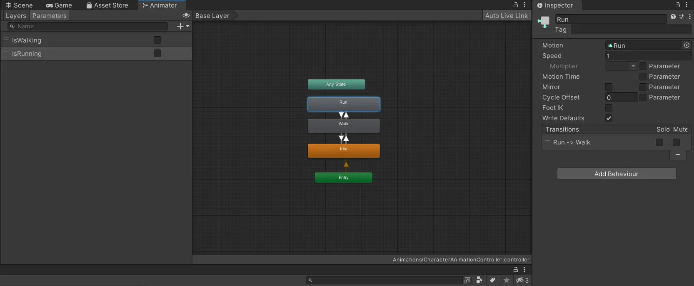
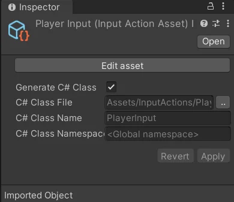

I followed this tutorial https://www.youtube.com/watch?v=bXNFxQpp2qk&list=PLwyUzJb_FNeQrIxCEjj5AMPwawsw5beAy&index=3

## Adding a 3D Character

## Animation States

Unity has it's own skeleton rigging system called Mecanim.

To add animations to a character, you first need to add an animator component to your character model and then create a character controller object and link it to the component. Double clicking the controller will then open up a panel to handle state transitions between animations.



There you can add each of the states you want to transition your model to and from. I set idle to be the default state which is self-explanatory. From there, I connect transition arrows between each of the states and set a condition for each of the transitions to occur.

The condition will just be a boolean that I can use later in script. These booleans can be declared on a side panel called **paramters**.

Lastly, you assign your animation to the motion property of each animation state.

Once this is setup, immediately you will see your character using the playing the animation and using the default state that's been set.

## Character Inputs

### The Old Way

The old way of managing inputs in Unity is by using the input manager accessible in the project settings. There you can set mapping of keys to actions and use those new naming in code. For example, you can map **W** and **UP** to **jump**, and use that naming in your code. Whenver you need to change it, just change it from the input manager instead of digging through code.

```C#
if (Input.GetKeyDown("jump")) {
    // do stuff
}
```

### The New Input System

However, this system has a few drawbacks

- Dynamically changing the bindings is difficult
- Can have some confusion over the types of inputs (Controller vs Joystick)
  
The new input system comes with addresses to these as well as a load of new features that make it much easier to manage all types of inputs and switch them on the fly without needing to write a bunch of your own code.

These are the basic steps from what I've gathered

1. Create an InputActions object (Usually like to create a seperate directory for the file)
2. Open it and setup new maps and bindings (there are defaults that may fit your needs as is)
3. Add a new C# script to your character to handle movement
4. In the awake function access your components as well as creating a PlayerInput object to access your InputActions

    ```C#
    private void Awake() {
        input = new PlayerInput();
        characterController = GetComponent<CharacterController>();
        animator = GetComponent<Animator>();
    }
    ```

    > Notice this PlayerInput class was generated by ticking the "Generate C# Class" option from the InputActions object. This is an alternative way to access PlayerInputs instead of adding the component directly to your character and attaching the relevant scripts.
    

5. From there you can access your **inputs**, **animations**, as well as **character manipulation**. I won't go into the logic but I will leave some examples of how to use these classes.
    - Input callbacks

        ```C#
        input.Player.Move.started += onMoveInput;
        input.Player.Move.canceled += onMoveInput;
        input.Player.Move.performed += onMoveInput;
        ```

        A list of callback functions you add to be triggered after the indicated events
    - Animator Parameters

        ```C#
        isWalkHash = Animator.StringToHash("isWalking");
        bool isWalking = animator.GetBool("isWalking");
        animator.SetBool(isWalkHash, true);
        ```

        Altering the parameters let's you start and stop animations based on your state graph.
        The `StringToHash` is a performance optimization to use instead of pure strings to access a parameter
    - Manipulating the character

        ```C#
        characterController.Move(currMove * currRunMultiplier * Time.deltaTime);
        ```

        Use Unity's built in controller to handle movement and collisions. In this case, to move the character.