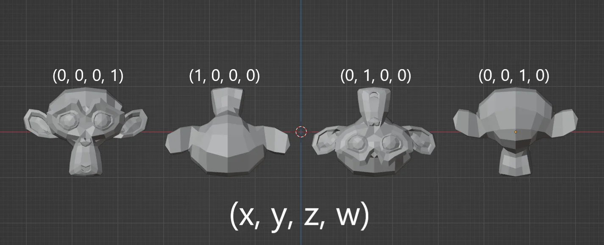
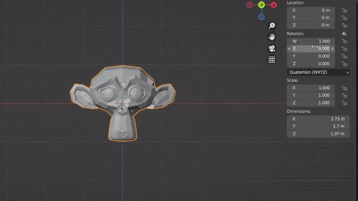
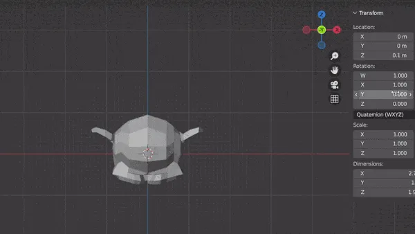

When describing rotations of an object, the typical way would be through linear algebra and trigonometry. However, similarly to how complex numbers can be used to describe rotations in 2D, quaternions allow efficient and more pragmatic methods describing rotations in 3D.

## How It's Done With Trigonometry

Depending on the framework or software using, a lot of the work is already done for you with API available to you to perform rotations on shapes. But for a simple point in space rotating in about an origin, what would that look like?

You can represent the x and y position of a point as a function of the angle and radius of the point on a unit circle. That is using our good friend SOH CAH TOA, you can represent *x* and *y* as:

```R
x = r x cos(\theta)
y = r x sin(\theta)
```

Then you can sub into \theta, the angle around the origin you'd like the point to sit.
However, this requires knowing the current angle the point sits at which adds another layer of computation. I got this proof from [Khan Academy](https://www.khanacademy.org/computing/computer-programming/programming-games-visualizations/programming-3d-shapes/a/rotating-3d-shapes) that gives the rotated point in relation to it's original position and the desired angle of rotation.

```R
x′=x×cos(β)−y×sin(β)
y′=y×cos(β)+x×sin(β)
```

From there, you can apply this formula to every point and depending on the axes you're rotating in space, we just swap the coordinates in the equation to the ones that change such as the `z` coordinate.

For example, instead of rotating about the Z-axis to rotate about the X-axis you'd do the following.

```R
z′=x×cos(β)−y×sin(β)
y′=y×cos(β)+x×sin(β)
```

In the case of a framework like ThreeJS, you'd represent each object rotation as a Vector3 containing all three axes. You can determine set each individual rotation directly without doing any of the math.

So far, we've been looking at 3D rotations as a **manipulation of 3 axes of rotation** also known as **Euler Angles**. However, this method of handling rotations is susceptible to 2 main probles.

- Gimbal Lock - When two axes of rotation line up, two of the rotation axes perform the same rotation causing a loss of a dimension of rotation. This is shown beautifully by [GuerrillaCG](https://www.youtube.com/watch?v=zc8b2Jo7mno)
- Interpolation - It's exceedingly difficult to accurately move smoothly between different rotations

## Quaternions

At first, the idea of using a whole different number system just for rotations can be quite abstract and even visualizing it is even more so. But, once the fundamentals are understood of how and why this works so efficiently, quaternions can be used very easily in software packages like Unity that handle the math calculations for you. A great explanation of application can be found [here](https://www.youtube.com/watch?v=1yoFjjJRnLY) while a more comprehensive look at the underlying math is given by the always fantastic [3Blue1Brown](https://www.youtube.com/watch?v=d4EgbgTm0Bg)

### Visual Understanding in Software

Applied in blender, you may notice that influencing a single quat value doesn't rotate the way you expect. Instead, altering a lone quat value will only flip the mesh into different orientations as follows, no rotations in between.



Smooth rotation starts happening when you influence multiple values at once. In essence, the orientations are mixing depending on the weight you give to each value. Therefore, when thinking about how each quaternion value relates to its 3D rotation, you can think of a quaternion rotation as **mixing together these four orientations in order to create the desired rotation.** Of course, it's not that simple as the way the mixing and rotating happens is a result of the underlying math but I think this way of thinking offers better visual and it can aid in understanding what's really happening.

For instance, if you start with the model facing towards us with the quarternion `(0, 0, 0, 1)` and we want to flip it 90deg about the X-axis. What we should really be thinking is *"Which two orientations can I mix to get what I want"*. You might notice in the above example that a quaternion of `(1, 0, 0, 0)` rotates 180deg about the X-axis. So, wouldn't we be wanting some rotation in between these two? This is precisely the answer. `(1, 1, 0 0 )` mixes evenly the starting position and the 180deg rotation to result in a 90deg rotation.



For more complex rotations, you can imagine mixing in the other values to get further rotations. Here I add to Y and the mesh rotation mixes towards the upside-down, front facing position.



it turns out you can achieve every 3D rotation this way without any of the drawbacks of Euler rotations.

One thing to notice is when mixing rotations, you can scale each value infinitely and the dominant value will mix the rotation the most. But to get a precise orientation, for example facing forwards, it's best to return to whole numbers and setting unneeded rotations to 0 instead of battling out which rotation wins.

## So Why Should I Use It?

It comes down to if and when you may encounter the draw backs of using Euler angles. Euler angles are much easier for understand and manipulate mentally but come with the Gimbal drawbacks and interpolation issues that can become a larger issue in physics and animations.

Typically, physics won't be an issue as you can allow game engines to take care of that for you. For animations, it can be a benefit to use Quaternions over Euler angles to circumvent undesirable rotation paths. Otherwise, if you're only performing 2D linear rotations, Euler angles can perform this perfectly and it only really comes to a mathematical and performance benefit with Quaternions.

In summary, **Quaternions are superior in every way except for human readability**.
