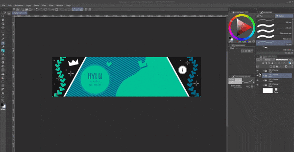
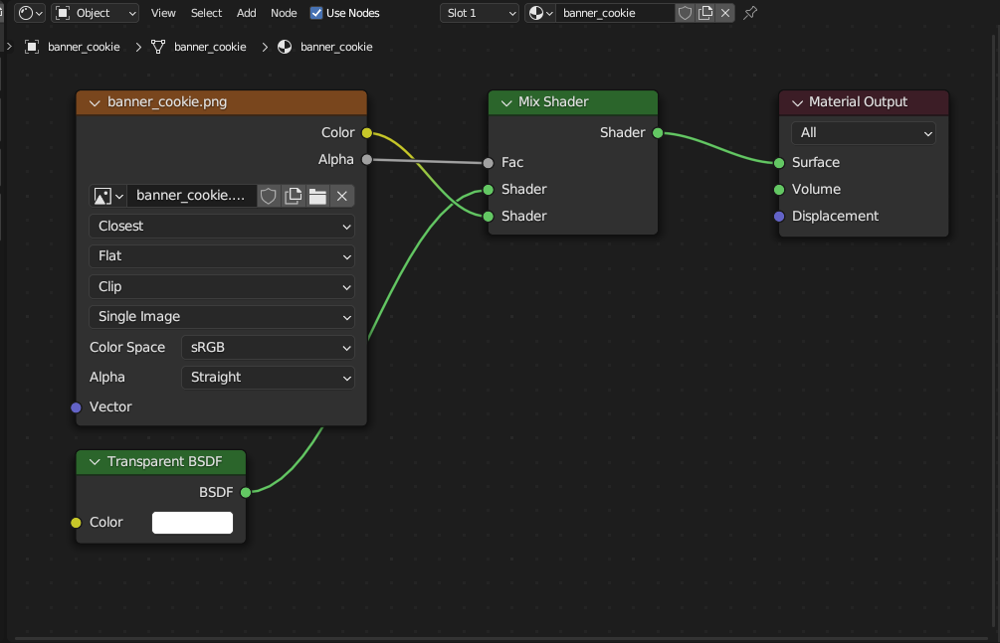
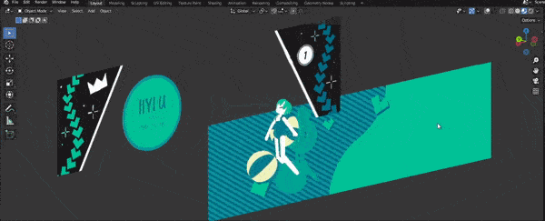
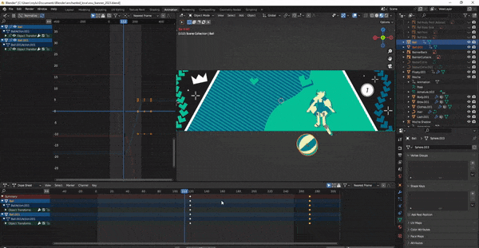

After submitting my [last osu fanart](), I decided to make my own osu banner. My profile was looking pretty empty without one and I figured after all that work to put together my own rendition of *Enchanted Love*, **might as well put those meshes to more use**. I wanted to keep it fairly simple as I know I'm pretty limited in gif size and quality for it to work as a profile banner (otherwise if it's too large, the auto-compression will convert the image into a static jpeg).

## Designing the Banner

I did some playing around and took some inspiration from this amazing art work.

From my previous artwork, **I already had a lot of the patterns created as well as familiarity with the style** so it really was a process of just stamping around different shapes and decorations until I liked it.

Once the main banner was done, I exported them in layers so I can seperate out where I want the foreground and backgrounds to be in relation to the animated characters.

## Layering into Blender

With those exported, I moved on to organizing them into Blender. **It took me a while to realize that just importing them is as images wasn't going to render**. Turns out, pure image objects are more for reference than anything. Instead, I needed to create an actual object in Blender and have the image on it as a texture. Luckily Blender has a nifty addon to import images directly as plane objects which will render.

However, I had a lot of trouble getting images as planes to show up because in my original project, **I forgot I removed the world lighting entirely**, so any objects with just the base shaders would just render black with no light. Once I realized this, **I had to create a new shader**. It seemed simple enough by just plugging in the image color directly into the material output but I forgot about the transparent parts of the images, they would also just render black this way. I managed a solution by mixing the image colors with a transparent shader and deciding when to mix into transparent based on the alpha channel of the image. Looking at it now, seems pretty obvious, but boy it did not come easy.

> As a self note, there was a bit of white dithering around the pngs when I imported them in. **By changing the image node interpolation from *linear to* *closest***, the issue was gone. The white dithering is still in the original image though this is just an issue with Clip Studio's exporting. Apparently, Photoshop has a "matted" option when exporting png's which removes dithering. Hopefully, a future version of CSP will also have the feature.

Once I finally got the images texture to show in full color, I could start layering up the banner.

## Animating

Animating was pretty simple, I only animated the positions of the characters and props with a subtle rotation to *Mocha's* head to give her a little bit more life as well as the beach ball. Seeing the rotations in the final render really adds a cool depth to what is otherwise a very 2D composition.

Last thing to do is crank out final render and we're done!

> Well, almost. I had to convert it to a gif and do some optimizing to make it fit as a banner. As per usual, the online tool ezgif is perfect for the job. In summary, I converted it to a banner sized gif, removed duplicate frames at the beginning and end, extended the final frame duration so the loop isn't too distracting, removed some in between frames to save space, and ran their optimizer to reduce the file size (around .94mb seems to be the sweet spot to not get auto-compressed).

Check out the final piece on my profile!

> https://osu.ppy.sh/users/13895854