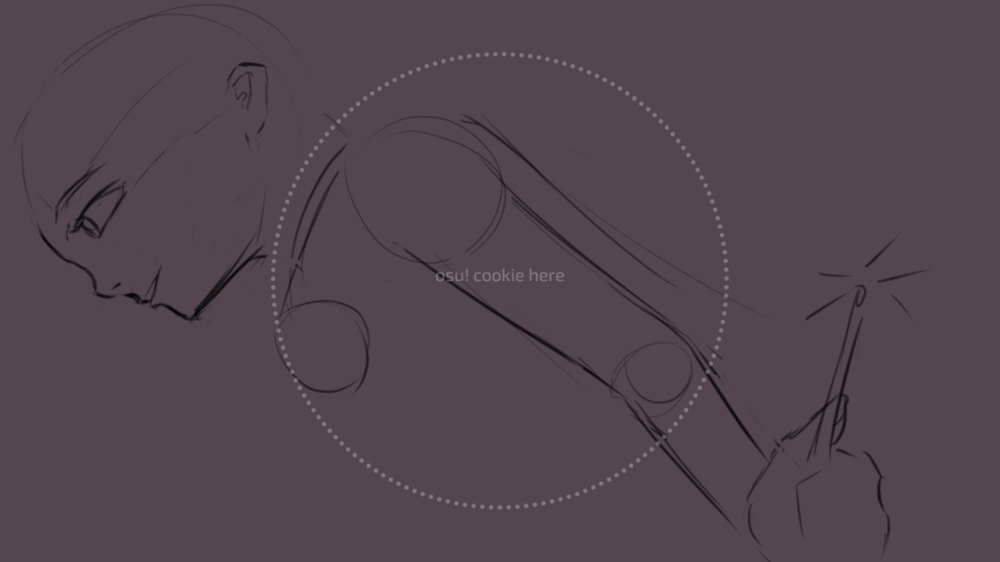
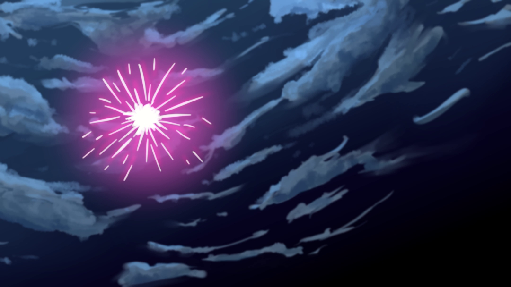
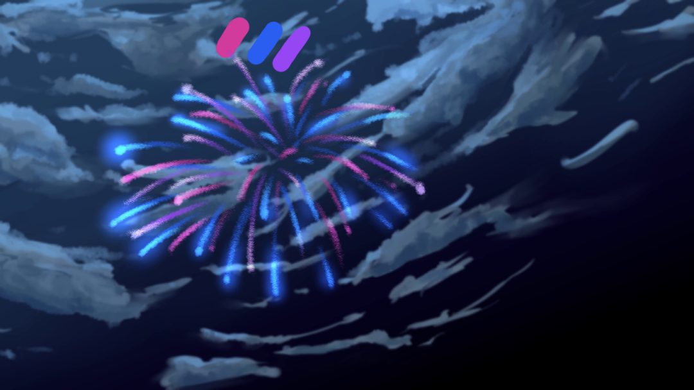

## osu! Fanarts?

Osu holds several fanart contest every year with themes often related to the time of year. Themes such as Winter or Halloween are such examples. Regardless of theme, the general idea seems to always be to draw any of the osu [mascots](https://osu.ppy.sh/wiki/en/Mascots) inside or partaking in said theme.

At the time I had been playing osu for about 4 months and really enjoying it. On the other hand, I've been drawing casually for a few years as a hobby so it seemed naturally to want to give these contests a shot. Particularly, I saw it as an opportunity to push my art skills (as usually I just doodle around rather than create full pieces) as well as something to occupy my time.

## New Beginnings

This was my first ever entry into a fanart contest. The theme of this year was as the name suggests was, *new beginnings*, as a hallmark of the coming new year and for the future of Osu. The original post can be found [here](https://osu.ppy.sh/home/news/2022-11-27-new-beginnings-art-contest).

The newness of it all actually gave me a lot of motivation and ideas for what to draw. Admittedly, I enjoy drawing anime girls so naturally I acclimated to making the girls a focal point. Actually anime is quite closely connected with Osu in it's mascots and beatmaps anyways so its a pretty natural direction. I ended up deciding on drawing Pippi in a kimono partaking in a a Japanese New Year Festival.
In my early sketches, I wanted to go with a fairly exaggerated perspective to hopefully make the piece feel more dynamic and also as practice for me in drawing perspective.

I tried sketching out the perspective freehand but it didn't take long to realize that I needed some reference.

Luckily, Clip Studio Paint has a 3D model feature that let me place some character as well as background models.


    
    


These fireworks were a memorable challenge cause it was one of the times I where I just felt completely lost as to how to draw something. I had some fundamentals of painting and texturing that I could apply to something like the clouds but when it came to the vibrancy of fireworks, I didn't even know where to start. I started off by following some tutorial I found online but it just kept looking like neon lightsticks sprawled out into a flower.

 After a few hours I gave up following direct tutorials and just went back to looking at a bunch of anime references (think Kimi No Na Wa) and tried my best to replicate it through blending layers. The result look 10x better and although it wasn't nearly anything close to the references I used, I was more then happy to move on.

Though I must add, later I added some of the fireworks lighting onto the clouds and that really sold the look I wanted.

Once I got most of the base colors and shadows worked out, it came time to work out the lighting. I went through a lot of iterations to try to get something that looked good. I really agonized over where the light source would be and how that would shine on the character and where shadows would be. In the end I kept getting results that had shadows that didn't feel right and also made Pippi less of the focal point I wanted. In the end, I just illuminated the parts I wanted to be on focus and then added a bunch of ambient light to balance out the shadows until it looked right. I'm a little disappointed I couldn't apply the lighting with more intention and spatial awareness but this was the best I could do for now. Perhaps next time I'll use more references to base my lighting upon.

There were plenty of more things that had gone through my mind while drawing this fanart but I am writing this log long after the fact so much of it isn't fresh in my mind and I might just be too lazy right now to recount it all heh. In any case, below is a final timelapse of my work using Clip Studio's built in timelapse function. It doesn't include any of the CTRL+Zing I did which may as well have been 50% of the whole drawing process.



All in all, I'm really proud of what I managed to create but if anything it let me appreciate how talented the other art submissions were (seriously, [check them out](https://osu.ppy.sh/home/news/2022-12-31-new-beginnings-results)) and where my current strengths and weaknesses are. It's so valuable and it makes me want to participate in more of these contests.