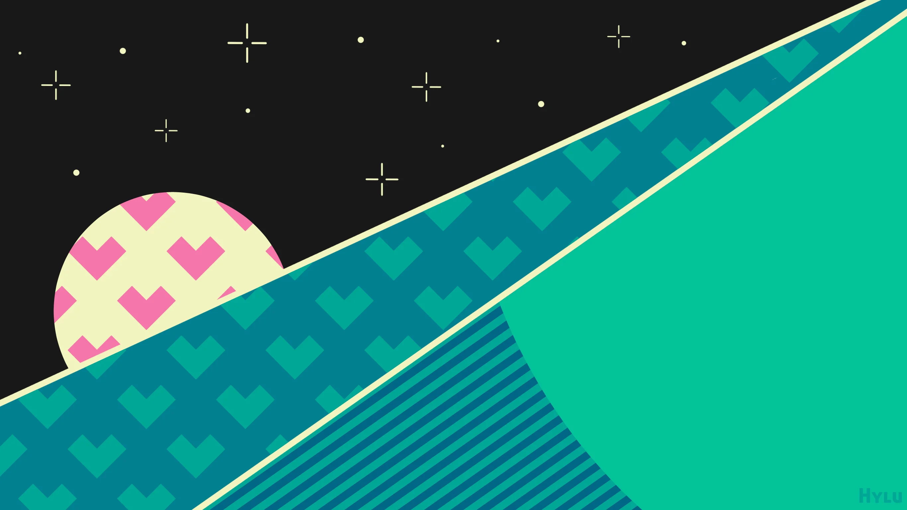
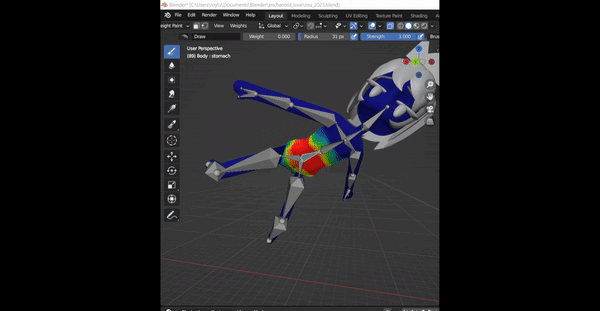
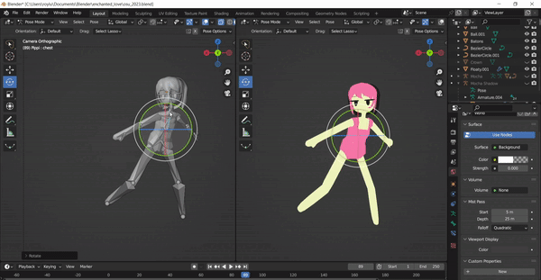
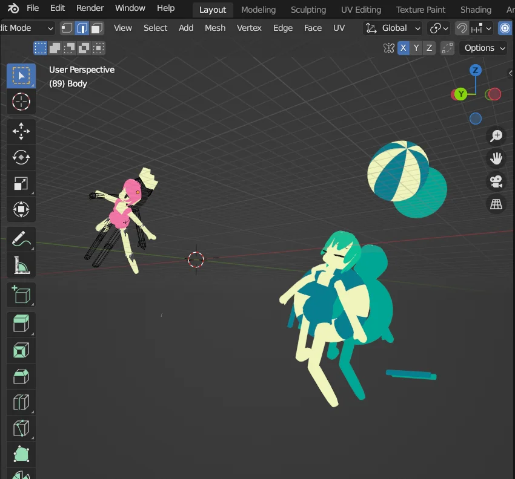
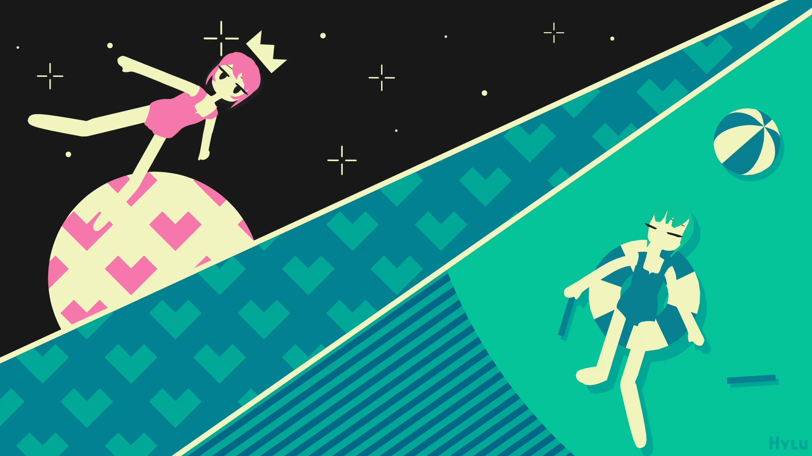

# Journey into a Beatmap

## Getting Started

After doing my first fanart, I didn't have any intention of doing another but this one's theme instantly gave me the idea of incorporating 3D modelling into the art piece. In summary, the theme is to create an Osu fanart with the OC's [inside a beatmap](https://osu.ppy.sh/home/news/2023-03-24-journey-into-a-beatmap-world-art-contest).

I immediately had the idea of drawing [Enchanted Love](https://vimeo.com/464209759) as I fell in love with the visuals from the original MV. I also had some inkling that the video itself was done in 3D after examining the characters movements. I thought, "well isn't this a good excuse to learn some Blender then?" That's how I got started.

At first, the idea of recreating these visuals in **Blender** was purely conceptual but after doing some digging, I came across some helpful posts on Mozuya's twitter that shed some light into their process.


From there, I took a detour from working purely on the art piece to learning some blender fundamentals through a doughnut rendering tutorial from [BlenderGuru](https://www.youtube.com/watch?v=nIoXOplUvAw)

My result from the tutorial looked pretty bad I think, especially if you compare it to his results. I decided not to overthink it as I just wanted to get a feel for how to use the software anyways. *Also a note for myself, I chose to render with Eevee as opposed to Cycles.*

## The Background

Once I got some Blender fundamentals to work with, I figured it was time to move on to modelling the characters for real... Except I really procrastinated this. It just felt daunting to actually start modelling anything on my own and when I did start I'd just scrap it after a few minutes and give up. Instead, I again took a detour and decided to put together a background for the art piece.

I had a lot fun with this. Since the background is purely graphic rather than painterly, I felt a lot less of that artist daunt that kept me from starting anything. I didn't have to worry about line consistency or symmetricity, in fact, I did everything with my mouse.

The repeating patterns (the hearts) were really satisfying to make. A simple picture suddenly becomes a visually pleasant mosaic just through some basic tiling. Perhaps the speed of putting together a more graphic art style made it more enjoyable.

Once the background was finished, I had a new found motivation to get started on the Blender portion (in actuality, I still procrastinated to the last couple days before the deadline).

## Modelling

Modelling was mostly a trial and error process of moving points around until I got the right shape. I made heavy use of the *Mirror* modifier to keep the shape consistent and essential do half the modelling work. **I would include some more examples of this process...** But once again, I am writing this long after the fact and I don't feel like backtracking to get a few clips heh, apologies!

I will however highlight the **rigging** and **weight painting** because that really boggled my mind. I had done some weight painting for my practice doughnut to paint over the sprinkle distribution over the top of the doughnut. I did not expect weight painting to be an integral part of skeleton rigging though. Turns out, each joint in the skeleton rig is associated to the mesh through a heatmap which determines which part of the mesh should move. Hot spots means the mesh will firmly twist and bend on the joint, cold spots, less so.

There is an option to have Blender automatically weight paint for you but it was extremely off when I used it on my mesh so I had to manually weight paint everything.

Often, I get lazy whether it's making my bed or cleaning the house. Creative work is no different. The shadows of Mocha (the green haired girl) aren't actually shadows at all. I just duplicated all of the meshes and shaded them to the colour I wanted. I then shifted their axes behind and slightly to the side of the real meshes to mimic shadows. I'm sure there's some way to project to model onto some plane under it and get a much more accurate and resourceful shadow but I was running out of time (less than an hour left) and brain cells to explore that solution. So instead this is what I did and it worked. I remember a quote that went something like ***it's better to fake it than to make it***. Something one of the Rainworld devs said I believe. Well, here it is in action.

Finally, I composited my background image behind my meshes and gave it the final render.

