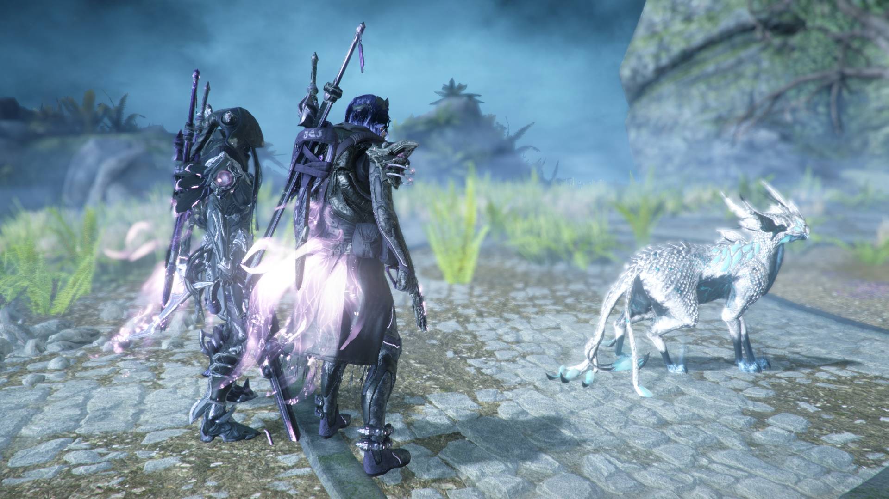
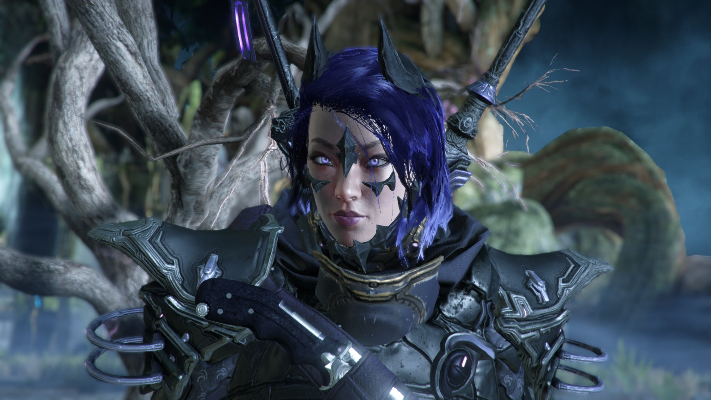
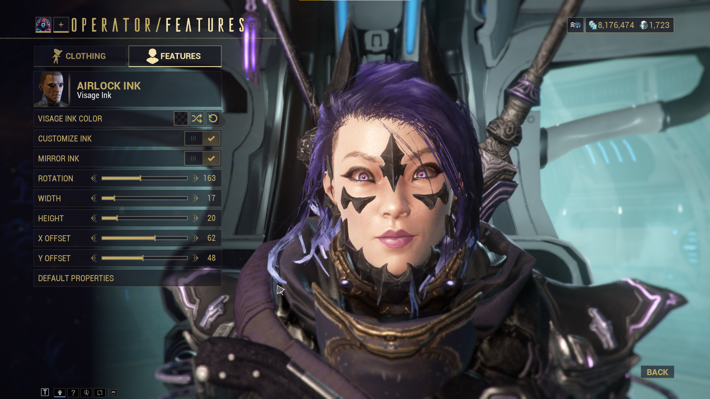

Warframe recently released it's long awaited update, **The Duviri Paradox**. I've been silently waiting for it's release since it's been talked about and delayed for many years. I played some and overall and I feel like I could pretty well enjoy it if not for the bugs. I think the push for slower paced gameplay is cool but just doesn't really have a future with the rest of Warframe. I was a little disappointed how this really ends up as a huge, sectioned off experience with little impact on the rest of the game. For example, I was hoping they'd upgrade Drifter/Operator gameplay to really stand on its on and work better in conjunction with Warframe play. **Still, from a creativity and art side, quite beautiful!** I have more thoughts but let's leave it at that.

**I really shouldn't be playing games at the moment**, but I can't help but want to sink my mind into anything other than improving myself. Perhaps it's again the daunt of starting any project. In particular, **I've been wanting to start my dive into Unity** but I can't seem to bring myself to do it. I'm writing this out frankly, in hopes that it will help me confront my current mindset and dive right into it.

**Still, I'd like to share my Drifter.** Rather than the Duviri update itself, I've been most happy with my improve operator cosmetics, now that they've added visage inks. The ability to use the face paints as a **pseudo eye-liner** is such a game changer to making operator faces not look so weird. I also continue to enjoy my Ivara fashion. I was happy enought to even make a [Reddit post](https://www.reddit.com/r/Warframe/comments/131ex3o/came_back_to_the_game_for_duviri_and_learned/) hehe.

Usually the drifter faces look awkward and uncanny in Warframe so the face inks really help.

Anyways, now that I've shared my experience, let's put a cap on Warframe and see about getting some development progress! Or to even get started in the first place lol.
