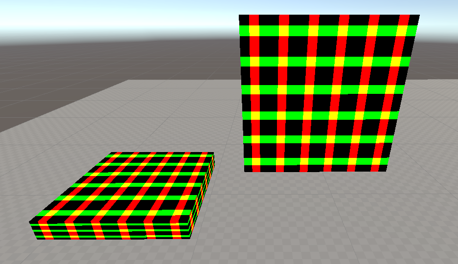
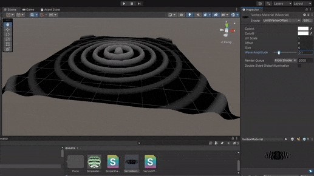
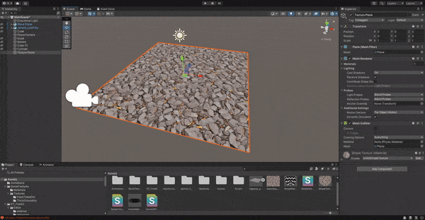
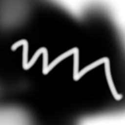
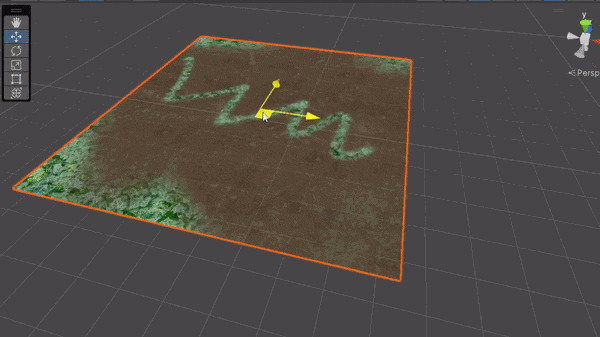



Shaders are programs used to describe how pixels should be arranged, colored, and transformed on the screen. The simple definition extends to so many applications especially in 3D graphics in movies and games. Every computer generated prop placed in a scene is carefully designed to look a certain way, all with the help of shaders.

Shader's make use of the GPU to constantly run concurrent calculation on every pixel and you can decide what those calculations do through programming with languages such as **HLSL** and **GLSL**. You can decide that very pixel should be moved slightly to the left, or that they should be slightly more saturated under certain conditions, or even that they have follow the movement of a sine curve and create waves like an animation. You might start to realize that there is a lot a math involved and there is. Specifically, the way you want to arrange pixels makes heavy use of linear algebra to orient points in space as well as creative calculus to take advantage of functions when wanting to create tailored movements and patterns.

Nowadays, shader graphs also exist to help abstract way some of the underlying math and allow a more approachable method of developing shaders at the cost of some control. It's is a fantastic tool that aids in the accessibility of shader programming as well as better visual understanding of how the flow of calculations vastly change the look of a mesh.

This post covers a summary of [Freya Holmér's course] on Shaders (<https://www.youtube.com/watch?v=9WW5-0N1DsI/> & <https://www.youtube.com/watch?v=kfM-yu0iQBk/>). Note, that **the following notes are in the context of Unity shaders** as shaders across different frameworks and engines are implemented differently and thus invite differing workflows and architecture. Conceptually they will be mostly the same.

## How Are They Used

It's better to talk about shaders in the context of how they're used which is typically starting from some material being fed into a shader and then placed onto an object.
Depending on the framework or engine that you're using, shader's can be used very differently. For instance, in Unity, your first have to start with a base material and then feed that material information into the shader to perform calculations on to get the final texture.


flowchart LR
    subgraph Shader Lifecycle
        x("Mesh") --> s("Shader")
        y("Material") --> s
        s --> f(("Final Mesh"))
    end


> Credits to [Navendu](https://navendu.me/posts/adding-diagrams-to-your-hugo-blog-with-mermaid/) for the tutorial on setting up Mermaid diagrams on Hugo

In other cases, you can directly apply a shader to an object or create the objects purely using shaders. It depends on the implementation of the graphics software but application is the same. **Manipulating pixels using the GPU**.

## The Unity Shader File


flowchart TB
    s(.shader)
        s --- p(Properties)
        s --- ss(SubShader)
        ss --- pa(Pass)
            pa --- v("Vertex Shader")
            pa --- f("Fragment Shader")
    sk((ShaderLab)) --> p & ss
    h((HLSL)) --> v & f


### Vertex Shader

From the **Mesh**, the shaders gets an overview of all the different vertices(points) that make up the 3D object and the following information for each vertex.

* Position Coordinates
* Normal (Where that vertex is facing perpendicular to it's surface)
* UV Coordinates
* Vertex Color
* More... (typically not needed)

The code you then write here can them perform any mathematical manipulation of the vertex as you'd like and **the code you write will run concurrently for every vertex** by your GPU. At a lower level, the vertices that the shader receives will by local to the objects origin for example it's position. After you perform your manipulation, it must then by converted into **Clip Space** to be used in the 3D world.his is also the set of vertices the fragment shader will receive. The next subsection will describe in more detail these coordinate systems.


flowchart LR
    z("Local Space Vertices") --> x{"Vertex Manipulation"} --> c("Clip Space Coordinates") -->|sent to| v(("Fragment Shader"))


In short, the job of the vertex shader is to...

* Manipulate the position of vertices
* Pass data into the fragment shader (ex. altering UV coords)

#### Coordinate Systems

> https://learnopengl.com/Getting-started/Coordinate-Systems

When meshes are shown onto the screen, the vertex information goes through multiple coordinate systems before it ends up mapped as a position on your screen. The shader will receive data in the first stage of these coordinate systems and will require conversion in order to understand how those vertex transformations relate to it's actual position in space and finally on your screen.

Though **the following coordinate flow is what's used for OpenGL** while Unity uses DirectX, the explanation of the differing coordinate spaces are helpful to know and relevant.

* Local Space - coordinates in relation to the objects origin
* World Space - coordinates in respect to the larger environment world
* View Space - coordinates in respect to what the camera perspective see's (particularly important when we compare how vastly different orthographic vs perspective camera represent space)
* Clip Space - Normalizes the coordinates between `-1 and 1` based on the camera. Off camera view vertexes will be outside of this range and not visible on your screen.
* Screen Space - Transforms normalized coordinates to viewport coordinates.

For the purposes of Unity, what's important is the **Local Space** which is how vertices are fed into a shader and **Clip Space** which we can convert to using a built-in Unity API.

### Fragment Shader

Here, rather than calculating per vertices, **Unity will rasterize the received vertices** so calculations can be done per pixel and the shader will run only on pixels visible in the clip space (between -1 and 1). This process is done behind the scenes and it known as **Frustrum Culling**.

> A cool side effect of this is **aliasing**. Imagine unity trying to figure out how to fit square pixels into the shape of a triangle face on a mesh. Some of those pixels will overlap outside the shape of the face and result in jagged edges which is what **anti-aliasing** serves to minimize.

Similarly to before, all code will run concurrently for every pixel.


flowchart LR
    z("Clip Space Vertices") --> x("Culled into Rasterized Pixels") --> c("Calculations") --> v(("Output on Screen"))


In order to rasterize, an important process that happens is **Barycentric Interpolation**. This blends the colours of each of the vertices to make approximate the colour of pixels between vertices. Otherwise, there's no explicit information for Unity to know how these areas should be displayed.


The fragment shader does not receive the vertex colours but instead, all the interpolated pixel colours.

In short, the job of the fragment shader is to...

* Determine the color of each pixel

## Unity Materials

Shader files are always associated with material files. You never apply a pure shader file to a object but instead a material which is then associated with a shader. This way, we can use the same shader across different materials.

### Shader Properties

You can pass information into the shader for use in calculation such as the game time or perhaps the health bar of a character. Using the health bar example, this can be useful as perhaps you want to proportion the filled amount of the health bar shown in the shader to it's actual game value. These properties can be set in the Material


## Code Structure of Shaders

```c
Shader "Unlit/SimpleShader" {
    Properties { // input data
        // _MainTex("Texture", 2D) = "white" {}
        _Value ("value", Float) = 1.0
    }
    SubShader {
        Tags {"RenderType" = "Opaque"} // allows determination of rendering properties. For the SubShader, this largely includes sorting alpha values, render queuing, etc.
        LOD 100 // level of detail, when you have multiple subshaders, they are prioritized based on this value

        Pass {
            Tags {} // Determination of graphics properties: blending modes, stencil properties, etc.

            CGPROGRAM
            #pragma vertex vert // tells compiler which function is vertex shader
            #pragma fragment frag // which function is fragment shader
            #include "UnityCG.cginc" // adds in built-in function from unity to aid in shader writing

            float _Value; // grabs from properties

            // sampler2D _MainTex; //texture stuff
            // float4 _MainTex_ST;

            struct MeshData { // per-vertex mesh data
                // Here you can decide what information you want to get from the mesh and store it in a variable by semantically declaring the data after a :
                float4 vertex: POSITION; // vertex position
                // float3 normals : NORMAL:
                // float4 tangent : TANGENT
                // float4 color : COLOR;
                float2 uv: TEXCOORD0; // uv0 coordinates
                //float2 uv1: TEXCOORD1; // uv0 coordinates
            };

            struct v2f { // data passed from vertex 2 frag shader
                float2 uv: TEXCOORD0; // 
                float4 vertex: SV_POSITION; // clip space coord of vertex
            };
            
            v2f vert(MeshData v) {
                v2f o;
                o.vertex = UnityObjectToClipPos(v.vertex); // converts local space to clip space
                return o;
            }

            // ## DATA TYPES
            // bool 0 1
            // int
            // float (32 bit float) good for world space
            // half (16 bit float) good for most things
            // fixed (low precision) -1 to 1
            // vectors: float4 -> half4 -> fixed4
            // matrices: float4x4 -> half4x4

            fixed4 frag(v2f i): SV_Target {
                return float4(1, 1, 1, 0);
            }
            ENDCG
        }
    }
}
```

### A Note on Shader Optimization

Generally, a mesh will have more pixels when rendered than vertices. It's usually best to do the calculations in the shader that has the least iterations. There may be more vertices than pixels in the case you have a high poly model being rendered from extremely far way. In which case after rasterization, you'll only have a few pixels for the fragment shader to process.

## Creating Some Simple Fragment Shaders

### Displaying 'Normals' as Colours


> Notice how the colors coorespond to the normals. The top is green as the normal on the top of the sphere is the vector `(0, 1, 0)`, therefore mapping to green as the color.

First, we grab the normal data from the mesh

```c
struct appdata {
    float4 vertex : POSITION;
    float2 uv: TEXCOORD0;
    float3 normal : NORMAL;
};
```

Next, we assign the normals in our vertex struct to the normals we took of the mesh.

```c
v2f vert(appdata v) {
    v2f o;
    o.vertex = UnityObjectToClipPos(v.vertex);
    o.normal = v.normal;
    return o;
}
```

Then in our fragment shader, we display each pixel as a color with rgb set to the normal vector and an alpha we'll just set to opaque.

```c
float4 frag(v2f i) : SV_Target{
    return float4(i.normal, 1);
}
```

### Repeating Patterns

There are a litany of ways repeating patterns can be achieved and naturally so, many involve the use of wave functions.

To start, try feeding the uv position into a sin function and watch the results.

```c
float2 col = sin(i.uv.xy);
return float4(col.xy, col.x , 1);
```

You'll find that there's virtually no difference compared to just feeding those uv coordinate to the fragment shader directly. If you think about what the `sin(x)` graph looks from 0 -> 1, it doesn't oscillate in the range and instead only increases. To be able to see any amount of repetition, we need to increase the period. Increasing it by 2π or τ, will fit the whole first cycle into the 0 -> 1 range allowing us to see the beginning of some repetition. But let's get several more cycles in with 6τ so we get a fuller hatching pattern instead.

From there, we may also want to phase-shift to get a more symmetrical pattern by having the peak of the sin wave in the center.

Now the hatching bars are quite blurry since there is a smooth shift between colours as the the pattern moves across the sin wave. Instead let's have the values round to the nearest integer with a cool trick `floor`

```c
floor(x + 0.5) // Rounds down below .5 exclusive and rounds up above .5 inclusive.
```

Finally, we get this hatched shader

```c
float2 col = floor(sin(i.uv.xy*6*TAU - PI/2) + .5);
return float4(col.xy, 0, 1);
```



We get can even fancier and add a wiggle to the stripes. For simplicity, let's add the wiggle just to the horizontal stripes. Intuitively, we want to do is shift the position of the pixels along the horizontal stripe up and down in a wave pattern.

Let's start by just adding an offset to those stripes.

```c
float offset = i.uv.x;
float2 col = floor( cos( (i.uv.xy+offset)*12*TAU)*.6 + .5 ); // I've made some period and amplitude adjustments as well
return float4(col.xy, 0, 1);
```

You'll notice that the horizontal stripes are now moving diagonally upwards because we're adding to them as we move left to right on the x-axis.

Now, it's as simple as adding a wave function to our offset and we'll get a smooth up and down wiggle to our line.

```c
float offset = .03*cos((i.uv.x)*6*TAU);
float2 col = floor( cos( (i.uv.xy+offset) *12*TAU) *.6 + .5 );
return float4(col.xy, 0, 1);
```

Similarly to the stripes themselves, I've adjusted the period and amplitude to change the look of the wiggles.


> Notice, though I'm only focusing on adding the wiggle to the horizontal stripes, they've also influenced the period of the vertical stripes. As the wave function of the offset peaks, **we're also phase-shifting the vertical lines** which is why there are tighter grouping of vertical stripes after the peaks of the horizontal waves and bigger gaps after the dips.

## Blending

If you're familiar with blending modes in programs such as Photoshop, the theory is the same. When pixels are being layered on top of eachother, you can manipulate how pixels above interact with the pixels below. For example, you can add the values of the pixels to result in brighter colors when layering colors or multiply colors resulting in darkening (as colors as normalized between 0-1).

The process of blending looks like this


The achieve different blending effects on shaders, you will be manipulating this equation to decide how the colors defined in your shader will be effected by the colors behind it.

```c
Cull Off // don't cull back or front faces (allows a transparent box to render the front and back)
ZWrite Off // disable writing to depth buffer
ZTest LEqual // <default> adjust render should read from depth buffer (Only render if the depth is less than or equal to)
Blend One One // set blending to additive (src*1 + dst*1)
//Blend DstColor Zero // multiply (src*dst + dst*0)
```

### Depth Buffer

When objects are in view of the camera, Unity will write its depth position from the camera as a value between 0 and 1. For other objects, their depth positions are also recorded but also compared to items already in the depth buffer. If they are behind an object, they will not render.

Objects that aren't in view can have their fragment shaders removed from the scene in order to save on resources that wouldn't be seen by the player anyways.

This can have side affects for transparency textures as you want to objects behind them to render fully in order to see the transparent objects in front them overlay their colors.

To remedy this, you can set Tags to notify Unity's renderer how they should deal with the shader

```c
Tags {
    "RenderType" = "Transparent" // tags to inform render pipeline of the type of shader (used in things like post processing)
    "Queue" = "Transparent" // adjusts draw order for transparency (render after opaque materials are rendered)
}
```

## Creating a Vertex Shader

Now that we're familiar with manipulating shaders on a per pixel basis, we can start thinking about **how we can apply the same process into the mesh vertices themselves**. Similar to how we're able to create patterns using math functions, we can also render our vertices along the same math functions as well. As an example, **we're going to create a rippling effect** where the shader creates actual ripples in the mesh shape just like a drop of water onto a still lake.

First, let's create the radial wave pattern in the fragment shader and apply that knowledge later into the vertex shader.
The idea is identical to the linear striped patterns from earlier but instead of following along one of the uv components, we will get the distance vector to the center of the mesh instead.

```c
float4 frag(v2f i) : SV_Target{
    float distance = length(float2(.5,.5)-uv.xy); // gets distance from center
    float wave = cos((distance) * 6 * TAU + _Time.y);
    return wave;
}
```

Now that we have our pattern, we can map that function directly into our vertex shader. The only difference is that **instead of assigning the wave value to a pixel color, we will now assign it as a transform to the y component of each vertex**, effectively bending the mesh up an down according to the cosine wave.

For posterity, let's also just stick the wave code into its own function as well as tweaking it to look more ripple-like.

```c
float getWave(float2 uv) {
    float distance = length(uv * 2 - 1); // [another way] normalize the uv coordinate from -1 to 1 with 0 as center and get distance
    float wave = cos((distance) * 6 * TAU - _Time.y);
    wave *= _WaveAmp; // property to adjust wave height in inspector
    wave *= (1 - distance); // dissipate over distance
    return wave;
}
v2f vert(appdata v) {
    v2f o;
    v.vertex.y = getWave(v.uv0);

    o.vertex = UnityObjectToClipPos(v.vertex);
    o.normal = mul((float3x3)unity_ObjectToWorld, v.normal); // UnityObjectToWorldNormal(v.normals);
    o.uv = (v.uv0 + _Offset) * _Scale;
    return o;
}
float4 frag(v2f i) : SV_Target{
    float wave = getWave(i.uv)*2;
    return wave;
}
```

And just like that, we have waves in both the pattern and shape of our plane.


> With dissipation



> Without dissipation

## Texture Sampling

So far, we've been using shaders on textureless materials but often we want to use shaders to enhance existing textures that are on materials. For example, we might have a photo-realistic mud texture that we want to apply a shader to add some bumps and dips based on the texture.

Compared to the previous shaders, there's a few new pieces of code we need to include for us to use the colour data from the current material.

```c
Properties{
    _MainTex("Texture", 2D) = "white" {} // pass the texture data, 2D is most common but other types like 3D exist
}
// variables
sampler2D _Maintex; // variable for texture data
float4 _Maintex_ST; // optional, holds tiling scale (_ST is a Unity semantic and automatically gives it the tiling data)

v2f vert(appdata v) {
    v2f o;
    
    o.vertex = UnityObjectToClipPos(v.vertex);
    o.uv = TRANSFORM_TEX(v.uv, _MainTex); // optional, scales the uv based on the tiling offset above
    o.uv = v.uv // otherwise, assigning the uv directly works the same
    return o;
}

float4 frag(v2f i) : SV_Target{
    fixed4 col = tex2D(_MainTex, i.uv); // samples a color from the texture based on the uv
    return col;
}
```

### Mapping a Texture to World Space

Normally, when you map a material onto a mesh, you want to link the material position strictly to the UV coordinates of the object. In some cases such as for ground textures with planes, it can be really useful to instead map those into the world. This makes it so as you move or add more objects using, they can seamlessly use the same pattern.

To do this, we first need to **convert each vertex coordinate into its respect world coordinate**. This is also an opportunity to take advantage of TEXCOORDS as we need someplace to store these coordinates so they are accessible in the fragment shader.

```c
struct v2f { 
    float2 uv: TEXCOORD0;
    float3 worldPos: TEXCOORD1; // empty coordinates we will later use to store the converted vertex coords
    float4 vertex: SV_POSITION;
};
v2f vert(appdata v) {
    v2f o;

    o.worldPos = mul(UNITY_MATRIX_M, v.vertex); // converts vertex coords to world coords by multipling be Unity's model matrix
    o.vertex = UnityObjectToClipPos(v.vertex);

    o.uv = TRANSFORM_TEX(v.uv, _MainTex);
    o.uv.x += _Time.y*.1 ;
    return o;
}
```

Now, instead of using the UV coordinates to sample a color from the texture, we're going to use the world position.

```c
float4 frag(v2f i) : SV_Target{
    float2 topDownProjection = i.worldPos.xz; // We want to apply the texture only to the top of a flat plane so we take the x and z coordinates.
    fixed4 col = tex2D(_MainTex, topDownProjection);
    return col;
}
```



### Texture Masking

We can also produce a masking effect by drawing another texture and using its values to mask out specific parts of our main texture. This is the same as you would do when masking textures on photoshop.

To begin, let's create a mask and play with it. We'll do a simple mask of black and white. This is drawn simply in Clip Studio.



Create a new texture input we'll call `_MaskTex` and use the mask as an input.

To see how we can play with the values, sample the colors from the mask with our object uv and run it through a sign function to get waves of values based on the color at each pixel of the mask.

```c
float GetWave(float coord) {
    float wave = sin( (coord + _Time.y)*2*TAU ); // 2*TAU makes the period do two full cycles between an x input of 0-1
    // notice the repeating waves around transition between white and black from the original mask
    wave *= coord; // keeps colors that are already dark from cycling to white
    return wave;
}
float4 frag(v2f i) : SV_Target{
    col = tex2D(_MaskTex, i.uv);
    return GetWave(col);
}
```


### Mixing Textures

When you think of the ground texture of a surface, there's many component to it. There are dirt surfaces, grassy areas, rocks, and everything in between. You need a way to smoothly transition from one texture to another.

We can also mix between multiple textures through the use of lerp where the final parameter decides which texture to show. Instead, let's sub in our sample from our mask to decide between textures. With more detailed masks, you can get much more realistic transitions between different textures.

```c
float4 frag(v2f i) : SV_Target {

    float2 topDownProjection = i.worldPos.xz/5;

    float4 tex0 = tex2D(_MainTex, topDownProjection);
    float4 tex1 = tex2D(_SecondTex, topDownProjection);

    float mask = tex2D(_MaskTex, i.uv);

    col = lerp(tex0, tex1, mask);
    return col;
}
```



> We're still mapping the texture based on world coordinates so the textures is consistent no matter the position of the plane. Additionally, techniques such a noise are used to create better transition between textures but we remain this simple example for now.

## Mipmaps

When textures are stored in Unity, they are often converted into a series of lower and lower resolution images kept on one file. This way, when textures are shown on screen, Unity can sample from the lower resolution images based on the position of the camera from the texture to get cleaner and less noisy results.

* Isotropic - Stores series of smaller textures for better sampling at further distances
* Anisotropic - Stores series of squished textures for better sampling at extreme angles

## Filtering

* Single - No blending between pixels (nearest neighbour)
* Bilinear - Blends between pixels
* Trilinear - Blends between pixels and mip levels
  * Sometimes lines can show up on the texture when the sampler switches mip levels, especially for low angle anisotropics
