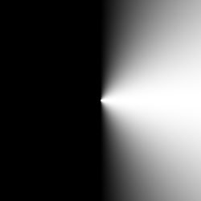
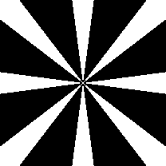



From what I've read, one of the classic shader introductions people reference is this online module-of-sorts known as **TheBookOfShaders**. On there, it covers topics of how math can generates different shapes and textures within shaders along with plenty of examples and tip from basic to more advanced creations.

## Drawing Circles

### A Circle Using `step`

To start, this is what it looks like using the `step()` function where for a circle of a `radius`, if the pixel is outside of this radius, give a value of `1`, if not, return a `0`. *Make pixels within `radius` away from the center white, otherwise black*

```c
float circle(in vec2 sst, in float radius) {
    vec2 dist = vec2(0.5)-st;
    float length = sqrt(pow(dist.x, 2.)+pow(dist.y,2.)); // getting magnitude of dist vector
    pct = step(length, radius);
}
```

### smoothstep

Something that confused me with smoothstep was that I expected the value returned to be the interpolated result of a start `a` and end `b` based off a fraction `c`. However it's actually the inverse operation. You instead give it a value between `a` and `b` and value `c` in between the two and you'll that percentage between the two back as a fraction of 1.

This is similar to the inverse lerp described by [Freya Holmér](https://www.gamedev.net/articles/programming/general-and-gameplay-programming/inverse-lerp-a-super-useful-yet-often-overlooked-function-r5230/)

This was confusing as most interpolation I've used previously (typically in a function just called lerp) has its third argument be the fraction of 1 to interpolate with.

```c
float lerp(float a, float b, float t) {
    return (1.0 - t) * a + b * t // for 0 <= t <= 1, return a value as a fraction t of the range a -> b
} // ex. lerp(0, 10, .5) = 5

float invLerp(float a, float b, float v) {
    return (v - a)/(b-a) // normalizes v between a and b to be between 0 and 1 and return that fraction
} // ex. invLerp(0, 10, 5) = .5
```

Once this was understood, things like generating circles with smoothstep made a lot more sense.

### A Circle Using `smoothstep()`

Now approaching with `smoothstep()`

```c
float circle(in vec2 st, in float radius) {
    float length = distance(st, vec(0.5)) // using GLSL built-in instead
    return 1. -smoothstep(radius-(radius*0.01), radius+(radius*0.01), length);
}
```

Effectively. this does the same thing except changes around the logic and blurs the edges of the circle.

This works largely the same as the step function except instead of a single number edge, you have a range between
`radius-(radius*0.01)` and `radius+(radius*0.01)`. If the interpolated value is under this range, smoothstep will return `0`. If the interpolated value is above this range, it will return `1`.

Now, if it's between this range, you will get a smooth fractional between `0` and `1` causing a transitional blurred edge to the circle as instead of flipping from black to white (0 -> 1), it blends towards it for the width of that range. 

The range, TheBookoOfShaders gives it is small in order to keep the circle quite sharp. But, by increasing the range, the blur becomes much clearer.

### Dot Product to Calculate Vector Length?

Generally, division is a costly operation for computers and thus so is the square root. For this reason, if there's an alternative to getting the length of a vector than the Pythagoras Theorem, we'd like to use it.

> A [Doom developer](https://www.youtube.com/watch?v=p8u_k2LIZyo) when to great lengths to avoid performing the costly inverse square root operation that he developed a brilliantly cursed alternative to it.

The dot product returns the projection of one vector `v1` onto another and multiplies the length of the projection with that other vector `v2`. There are a couple things to note.

* The result is the magnitude of `|v1projected| * |v2|`
* The length of `v1projected` decreases the wider the angle between it and `v2`
* The general formula is `|A||B|cosθ`


In the case that `v1 == v2`, the magnitude of `v1projected == v1` as well. This means the result of the dot product is actually
`|v1|**2`!

```r
more formally...
if v1 == v2
then v1⋅v2 = v1⋅v1 = |v1||v1|cos(0) = |v1|**2
```

**We're now close to getting the length of the vector**, but again need to take to `sqrt` of it all the get the final length of `v1`.

Let's look at what TheBookOfShaders does

```c
float circle(in vec2 st, in float radius) {
    vec2 dist = st-vec2(0.5);
    float length = dot(dist, dist)*4.
    return 1. -smoothstep(radius-(radius*0.01), radius+(radius*0.01), length);
}
```

Instead, what TheBookOfShaders opts to do is to **multiply it all by 4 and call it day** `dot(dist, dist)*4`. I've done a bunch of playing around and all I conclude is, **this is not equivalent to the actual length of the vector**. Comparing it to using a distance function, radius of the circle isn't accurately represented. Instead, it following an exponential curve as you increase/decrease the radius value compared to a linear one where the value you input maps to the actual circle radii.

Ultimately, the purpose of their example is to showcase a circle in GLSL and even with the square of the vector length, it's still enough to show it, just not for the correct radius. I will say, the author should've multiplied it by 2, this way at least the max circle radius of `0.5` would match up with the correct distance function.

**So in the end, you're better off using the square root here.**

## frac

the `frac()` function is . It's often use to help visualize values in you're shader outside of 1. Specifically, shaders in Unity don't natively clamp values between 0 and 1 so if you're trying to create a gradient shader where color is based on the UV position on a mesh, that UV position can go above and below 0 and 1.

The implementation of `frac()` is incredibly simple and is as follows.

```c
float frac(float v) {
    return v - floor(v);
}
```

Frac will only return values between a range of 0 and 1 and if its fed a `v` out of this range, the pattern will repeat.
So you can surround your shader code with a frac and get a repeating pattern that looks like this.


## Generating Shapes with Arctangent

Trigonometric functions are closely tied with circles and are a key component to generating repeating, cyclical patterns. Here, we are taking a look at the power of the arctangent function.

To begin, the arctangent function when graphed is a right rotation and mirror of the standard tangent graph.


It can be hard to wrap your head around how each value of x in the arctan graph correlates to its plotted value but the key is to focus on how the arctan function relates to the tan function itself.

```r
arctan(x) = θ ==> tanθ = x
```

It's primarily used to find the angle between the opposite and adjacent sides of a trangle

```r
θ = arctan(opposite/adjacent)
```

When wanting to create patterns, this relation should be your tool to visualizing how patterns can be built with arctan.

For example, for every pixel we have a `vector2` of it's position and by subbing that into arctan, we can get the angle that the pixel lies from the origin.

Let's move the origin to the center and try plotting the angle directly to the color of the shader.

```c
void main(){
    vec2 st = gl_FragCoord.xy/u_resolution.xy;
    vec3 color = vec3(0.0);

    vec2 pos = st*2. - 1.;
    
    float r = length(pos)*2.0;
    float a = atan(pos.y,pos.x);
    color = vec3(a);
    
    gl_FragColor = vec4(color, 1.0);
}
```


In GLSL, atan has two overloads, first used here can have deceptive behavior when it comes to signs
> atan returns either the angle whose trigonometric arctangent is yx or y_over_x, depending on which overload is invoked. In the first overload, the signs of y and x are used to determine the quadrant that the angle lies in. The value returned by atan in this case is in the range [−π,π]. The result is undefined if x=0

.

For the second overload, atan returns the angle whose tangent is y_over_x. The value returned in this case is in the range [−π2,π2]
. n.

If we then sub the angles into `cos`, we get the adjacent side of the right triangle angled θ from the origin.



> The adjacent component is only positive in quadrants I and IV

What's exciting now is remember this is still a cosine function. We can increase the period in order to see more cycles.

```c
float f = cos(a*8.); // 8 cycles
f = floor(f + .5); // round to solid values
```



## Morphing Mosaic

```c
void main() {
    vec2 uv = gl_FragCoord.xy / u_resolution;
    uv = uv*2. - vec2(1.); // center origin
    float angle = atan(sin(uv.y*PI), sin(uv.x*PI));
    vec4 color = vec4(ceil(sin(angle*10. + u_time)));
    gl_FragColor = color;
}
```
